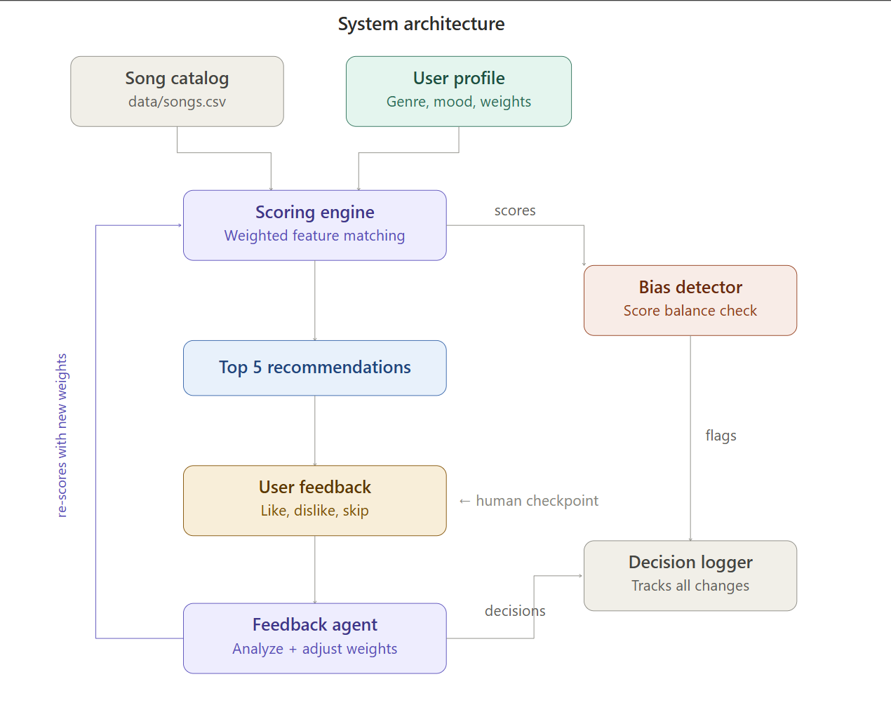

# Music Recommender with Adaptive Feedback Loop

## Base Project

This project extends the **Module 3 Music Recommender Simulation** - a content-based song recommender that scores songs against a user's taste profile using genre, mood, energy, valence, danceability, and acousticness.

The original system produced static recommendations with fixed weights. The extension adds an **agentic feedback loop** that adapts to user input and a **bias detector** that monitors the system's behavior in real time.

---

## What Was Added

The original recommender gave you 5 songs and that was it. The extended version turns it into a multi-round conversation:

**Feedback Agent** — After each round of recommendations, the user rates songs as like, dislike, or skip. The agent analyzes what the liked songs have in common versus the disliked ones, then adjusts the scoring weights for the next round. Over 2-3 rounds the recommendations visibly improve as the system learns what actually matters to the user.

**Bias Detector** — Runs after every scoring round and flags three problems: feature dominance (one feature carrying most of the score), low diversity (all results look the same), and low confidence (scores too close together to rank meaningfully). It doesn't fix anything — it raises warnings so the user and the feedback agent can see what's off.

**Decision Logger** — Every weight adjustment, its reasoning, and any bias warnings are written to `data/decisions.log` as timestamped JSON lines. This creates a full transparency trail showing exactly how and why the system changed over time.

**Test Suite** — 34 pytest tests covering scoring correctness, feedback analysis, weight adjustment logic, safety invariants (weights sum to 1.0, stay within bounds), bias detection thresholds, and multi-round integration tests with simulated users.

---

## System Architecture



The system has six components across three layers:

**Data layer** — The song catalog (`data/songs.csv`) and user profile feed into every scoring round. The user profile holds the taste preferences and the current scoring weights.

**Processing layer** — The scoring engine compares each song's features against the user profile using weighted similarity. The bias detector inspects the output and flags imbalanced scores, low diversity, or low confidence rankings.

**Human-in-the-loop layer** — The user rates the top 5 recommendations. The feedback agent analyzes the ratings, decides which weights to nudge (and logs why), then triggers a re-score. The loop repeats for up to 3 rounds.

---

## Project Structure

```
├── src/
│   ├── main.py               # Entry point — loads songs, runs feedback loop
│   ├── recommender.py        # Scoring engine, song loading, weight definitions
│   ├── feedback_agent.py     # Feedback collection, pattern analysis, weight adjustment
│   ├── bias_detector.py      # Feature dominance, diversity, and confidence checks
│   └── logger.py             # Writes decision log to data/decisions.log
├── tests/
│   ├── test_recommender.py   # Scoring and recommendation tests
│   ├── test_feedback_agent.py# 16 tests: analysis, decisions, integration
│   └── test_bias_detector.py # 18 tests: dominance, diversity, spread, combined
├── data/
│   ├── songs.csv             # Song catalog with audio features
│   └── decisions.log         # Agent reasoning trail (generated at runtime)
├── assets/
│   └── image.png             # Architecture diagram
├── model_card.md             # Reflection and evaluation
├── requirements.txt
└── README.md
```

---

## How The System Works

### Scoring Engine

Each song gets a similarity score (0 to 1) by comparing its features against the user's preferences. Genre and mood are binary matches — either the song is pop or it isn't. Energy, valence, danceability, and acousticness are compared on a 0-1 scale where closer values score higher.

Each feature has a weight controlling how much it influences the final score. The default weights start roughly equal (~0.17 each), but the feedback agent adjusts them based on what the user actually responds to.

### Feedback Agent

After the user rates 5 songs, the agent splits them into liked and disliked groups and compares their feature averages. If liked songs average 0.85 energy and disliked songs average 0.3, that 0.55 gap tells the agent energy is a strong signal — so it bumps the energy weight up by 0.05. If the gap is small, it pulls the weight down.

For genre, the agent checks diversity instead of averages. If the user liked songs across pop, rock, and jazz, genre matching clearly isn't the main thing they care about, so the genre weight gets reduced.

All weights are clamped between 0.05 and 0.40 (no feature is ever fully ignored or totally dominant) and normalized to sum to 1.0 after every adjustment.

### Bias Detector

Three checks run after each scoring round:

**Feature dominance** — Breaks down each song's score into per-feature contributions. If one feature averages more than 45% of the total score across the top 5, it flags a warning.

**Diversity** — Counts how many of the top 5 share the same genre or mood. If 80% or more are identical, it flags a bubble.

**Score spread** — Measures the gap between the highest and lowest scores in the top 5. If the spread is under 0.10, the system can't meaningfully distinguish between them and the ranking is essentially arbitrary.

### Decision Logger

Every round produces a JSON log entry containing the weights before and after adjustment, the reasoning string explaining each change, bias warnings, and rating counts. The log file is append-only so you can trace the full session history.

---

## Getting Started

### Setup

```bash
# Clone the repo
git clone https://github.com/YOUR_USERNAME/music-recommender-ai.git
cd music-recommender-ai

# Create virtual environment (optional but recommended)
python -m venv .venv
.venv\Scripts\activate          # Windows
source .venv/bin/activate       # Mac/Linux

# Install dependencies
pip install -r requirements.txt
```

### Run the System

```bash
$env:PYTHONPATH='src'; python -m src.main    # Windows PowerShell
PYTHONPATH=src python -m src.main            # Mac/Linux
```

The system will display 5 recommendations, ask you to rate each one (l/d/s), show the agent's reasoning and any bias warnings, then offer another round.

### Run Tests

```bash
$env:PYTHONPATH='src'; pytest               # Windows PowerShell
PYTHONPATH=src pytest                       # Mac/Linux
```

34 tests covering scoring, feedback analysis, weight adjustments, safety invariants, and bias detection.

---

## Demo Walkthrough

### Example 1: Pop/Happy/High-Energy Profile

User preferences: pop, happy mood, energy 0.8, valence 0.8, danceability 0.75.

**Round 1** — System returns 5 pop-leaning songs. User likes Sunrise City and Gym Hero (both high energy, high valence), dislikes three lower-energy tracks. Agent response: boosted genre (consistent pop preference), reduced energy (gap too small), boosted valence (liked ~0.80 vs disliked ~0.59).

**Round 2** — New top 5 shifts toward higher valence songs. Bias detector flags low genre diversity (4/5 are pop). User continues rating, weights adjust further.

### Example 2: Jazz/Chill/Low-Energy Profile

User preferences: jazz, chill mood, energy 0.3, valence 0.4, danceability 0.3.

**Round 1** — System returns mellow tracks. User likes across jazz and lofi (genre diverse), agent reduces genre weight. Bias detector reports healthy diversity and good score spread.

### Example 3: Bias Detection in Action

With a narrow catalog, the detector flags: "⚠ Low genre diversity: 80% of results are pop (4/5 songs)" and "⚠ Low confidence: score spread is only 0.087." These warnings are logged alongside the agent's weight adjustments.

---

## Demo Video

 [Loom Walkthrough](https://www.loom.com/share/356b4fd8e42e464eb757fe8ab3abcbce)

<!-- Replace with your actual Loom link before submission -->

---

## Evaluation and Testing

The system was evaluated through three approaches:

**Unit tests** — Each function in `feedback_agent.py` and `bias_detector.py` has dedicated tests verifying correct behavior, edge cases (empty input, all skips, single song), and boundary conditions (threshold-exact values).

**Safety invariants** — Tests confirm that weights always sum to 1.0 after adjustment, every weight stays within the 0.05-0.40 bounds even after 10 consecutive rounds, and the original weights dict is never mutated.

**Integration tests** — Simulated users with consistent preferences (e.g., always likes high-energy, always dislikes low-energy) are run through 3 rounds to verify that the relevant weight actually increases over time. A separate test checks that a user who likes across genres causes the genre weight to decrease.

---

## Limitations

This system uses a small static catalog and doesn't consider lyrics, artist popularity, tempo, or real listening history. Genre and mood are treated as exact string matches, so "indie pop" and "pop" would not match. The feedback agent only adjusts feature weights — it can't change the user's stated preferences or add new features. The bias detector watches the output but can't force the scoring engine to diversify results.

With a small catalog, the same songs tend to reappear across rounds since there aren't enough alternatives for the adjusted weights to surface meaningfully different results.

---

## Reflection

[**Model Card →**](model_card.md)

Building the feedback loop changed how I think about recommender systems. The static version felt like a calculator put in preferences and get results. Adding the agent made it feel more like a conversation where the system is actually listening. The most interesting discovery was how much the test setup can mask real behavior. A test that seemed correct was actually biased by the genre preference baked into the fake user profile.

The bias detector showed me that transparency isn't just about explaining results — it's about the system being honest about its own weaknesses. Flagging low confidence or genre bubbles gives the user information that most real apps hide.

---

## Portfolio

**GitHub:** [github.com/giliaddawite/music-recommender-ai](#)

**What this project says about me as an AI engineer:** I built a system that doesn't just produce recommendations — it adapts to feedback, monitors its own biases, logs every decision it makes, and has 34 tests proving it works correctly. I care about making AI systems transparent and reliable, not just functional.
