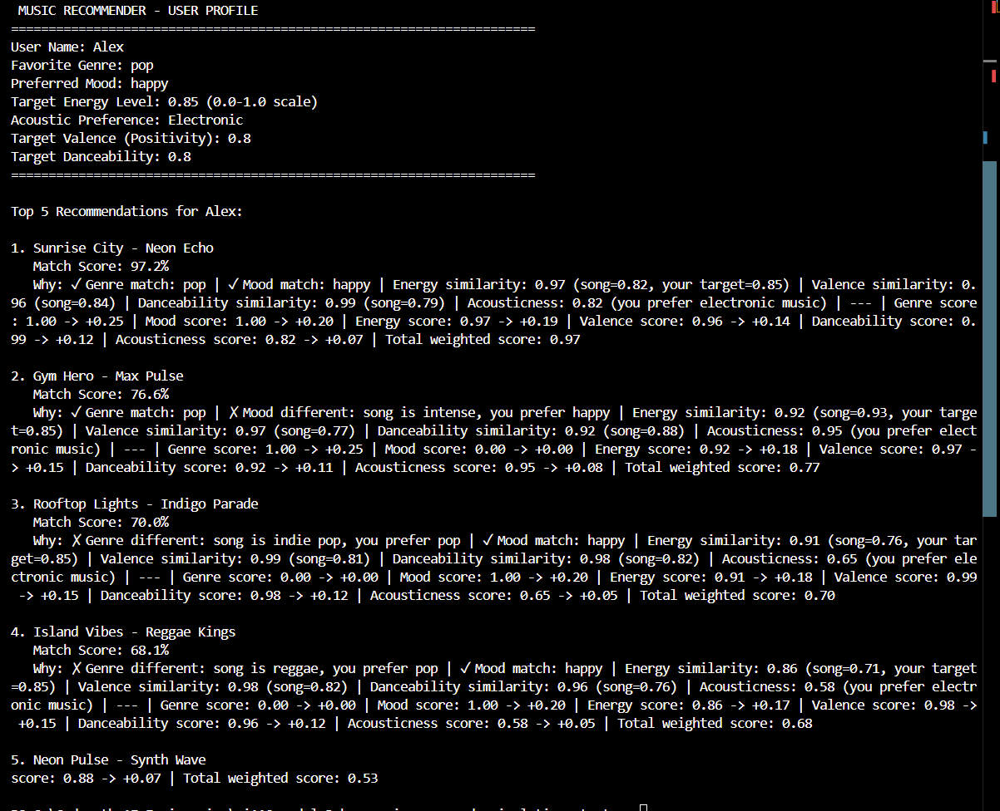
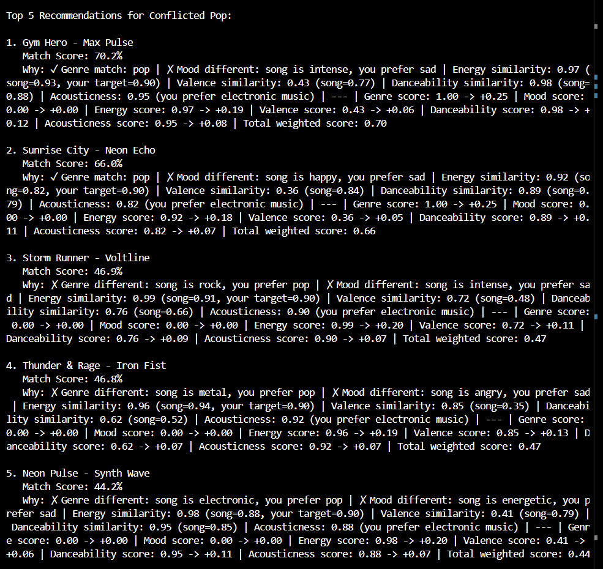

# 🎵 Music Recommender AI Project

[](https://www.python.org/)
[](LICENSE)

An intelligent music recommendation system that learns from user feedback to improve suggestions over time. Built with Python, featuring content-based filtering and adaptive weighting.




## ✨ Features

- **Content-Based Recommendations**: Matches songs based on genre, mood, energy, valence, danceability, and acousticness
- **Adaptive Learning**: Incorporates user feedback to dynamically adjust recommendation weights
- **Transparent Explanations**: Provides clear reasoning for each recommendation
- **Comprehensive Testing**: 20+ unit tests covering core logic, edge cases, and integration scenarios
- **Modular Architecture**: Clean separation between recommendation engine, feedback analysis, and user interface

## 🚀 Quick Start

### Prerequisites
- Python 3.8 or higher
- pip package manager

### Installation

1. **Clone the repository**
   ```bash
   git clone https://github.com/giliaddawite/music_reccomender_ai_project.git
   cd music_reccomender_ai_project
   ```

2. **Create virtual environment** (recommended)
   ```bash
   python -m venv .venv
   # On Windows:
   .venv\Scripts\activate
   # On macOS/Linux:
   source .venv/bin/activate
   ```

3. **Install dependencies**
   ```bash
   pip install -r requirements.txt
   ```

4. **Run the application**
   ```bash
   python -m src.main
   ```

## 📖 How It Works

### Core Components

#### 🎵 Song Representation
Each song is modeled with audio features:
- **Genre**: pop, rock, lofi, jazz, etc.
- **Mood**: happy, chill, intense, relaxed, etc.
- **Energy**: Intensity level (0.0-1.0)
- **Valence**: Positivity/cheerfulness (0.0-1.0)
- **Danceability**: Suitability for dancing (0.0-1.0)
- **Acousticness**: Acoustic vs electronic (0.0-1.0)

#### 👤 User Profile
Captures user preferences:
- Favorite genre and mood
- Target energy level
- Acoustic preference

#### 🧠 Recommendation Engine
Uses weighted similarity scoring:
- **Genre Match**: Exact match bonus
- **Mood Match**: Exact match bonus
- **Feature Similarity**: Distance-based scoring for numeric features
- **Adaptive Weights**: Learn from user feedback to prioritize important features

#### 📊 Feedback Analysis
Analyzes user ratings to detect patterns:
- Computes averages and gaps between liked/disliked songs
- Identifies genre diversity and feature preferences
- Adjusts recommendation weights based on feedback patterns

### Algorithm Flow

1. **Initial Recommendations**: Score all songs against user profile using default weights
2. **User Feedback**: Collect likes/dislikes/skips for recommendations
3. **Pattern Analysis**: Compute statistics on liked vs disliked songs
4. **Weight Adjustment**: Modify feature weights based on feedback patterns
5. **Improved Recommendations**: Generate new suggestions with updated weights

## 🧪 Testing

Run the comprehensive test suite:

```bash
# Run all tests
python -m pytest tests/

# Run specific test file
python -m pytest tests/test_feedback_agent.py -v

# Run with coverage
python -m pytest --cov=src tests/
```

### Test Coverage

- **Layer 1**: Core measurement accuracy (6 tests)
  - Energy gap calculations
  - Genre diversity detection
  - Edge cases (no likes/dislikes)

- **Layer 2**: Weight adjustment decisions (10 tests)
  - Gap-based weight modifications
  - Genre logic (diversity vs consistency)
  - Safety invariants (bounds, normalization)

- **Layer 3**: Multi-round integration (3 tests)
  - Learning behavior over time
  - Structural validity maintenance

## 📁 Project Structure

```
music_reccomender_ai_project/
├── src/
│   ├── __init__.py
│   ├── main.py              # Application entry point
│   ├── recommender.py       # Core recommendation logic
│   ├── feedback_agent.py    # Feedback analysis and weight adjustment
│   └── logger.py            # Logging utilities
├── tests/
│   ├── test_recommender.py  # Basic recommender tests
│   └── test_feedback_agent.py # Comprehensive feedback tests
├── data/
│   └── songs.csv           # Song dataset
├── assets/                 # Images and assets
├── requirements.txt        # Python dependencies
├── model_card.md          # Model documentation
└── README.md              # This file
```

## 🔧 Configuration

### Default Weights
```python
DEFAULT_WEIGHTS = {
    "genre": 0.17,
    "mood": 0.17,
    "energy": 0.17,
    "valence": 0.17,
    "danceability": 0.16,
    "acousticness": 0.16,
}
```

### Weight Bounds
- Minimum: 0.05 (prevents features from being ignored)
- Maximum: 0.40 (prevents single features from dominating)

## 🤝 Contributing

1. Fork the repository
2. Create a feature branch (`git checkout -b feature/amazing-feature`)
3. Add tests for new functionality
4. Ensure all tests pass (`python -m pytest`)
5. Commit your changes (`git commit -m 'Add amazing feature'`)
6. Push to the branch (`git push origin feature/amazing-feature`)
7. Open a Pull Request

## 📋 Limitations & Future Work

- **Small Dataset**: Currently uses static CSV data
- **Categorical Matching**: Genre/mood are exact matches only
- **Single Profile**: Assumes one taste profile per user
- **No Collaborative Filtering**: Doesn't consider other users' preferences

### Potential Enhancements
- Integration with Spotify API for larger datasets
- Fuzzy matching for genres/moods
- Multi-profile support
- Collaborative filtering hybrid
- Real-time learning from streaming data

## 📄 Model Card

See [model_card.md](model_card.md) for detailed model documentation including:
- Intended use and limitations
- Performance metrics
- Bias analysis
- Ethical considerations

## 📜 License

This project is licensed under the MIT License - see the [LICENSE](LICENSE) file for details.

## 🙏 Acknowledgments

- Built as part of AI Engineering coursework
- Inspired by real-world recommendation systems
- Dataset sourced from music analysis research

- What is this system trying to do
- Who is it for

Example:

> This model suggests 3 to 5 songs from a small catalog based on a user's preferred genre, mood, and energy level. It is for classroom exploration only, not for real users.

---

## 3. How It Works (Short Explanation)

Describe your scoring logic in plain language.

- What features of each song does it consider
- What information about the user does it use
- How does it turn those into a number

Try to avoid code in this section, treat it like an explanation to a non programmer.

---

## 4. Data

Describe your dataset.

- How many songs are in `data/songs.csv`
- Did you add or remove any songs
- What kinds of genres or moods are represented
- Whose taste does this data mostly reflect

---

## 5. Strengths

Where does your recommender work well

You can think about:
- Situations where the top results "felt right"
- Particular user profiles it served well
- Simplicity or transparency benefits

---

## 6. Limitations and Bias

Where does your recommender struggle

Some prompts:
- Does it ignore some genres or moods
- Does it treat all users as if they have the same taste shape
- Is it biased toward high energy or one genre by default
- How could this be unfair if used in a real product

---

## 7. Evaluation

How did you check your system

Examples:
- You tried multiple user profiles and wrote down whether the results matched your expectations
- You compared your simulation to what a real app like Spotify or YouTube tends to recommend
- You wrote tests for your scoring logic

You do not need a numeric metric, but if you used one, explain what it measures.

---

## 8. Future Work

If you had more time, how would you improve this recommender

Examples:

- Add support for multiple users and "group vibe" recommendations
- Balance diversity of songs instead of always picking the closest match
- Use more features, like tempo ranges or lyric themes

---

## 9. Personal Reflection

A few sentences about what you learned:

- What surprised you about how your system behaved
- How did building this change how you think about real music recommenders
- Where do you think human judgment still matters, even if the model seems "smart"